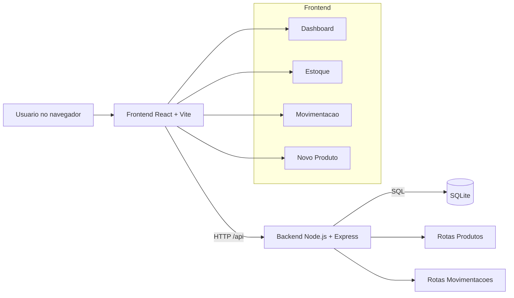

# Zenvyx Control

Monorepo de um sistema de gestao de estoque com frontend em React e backend em Node.js/Express com SQLite.

## Visao Geral

- Backend: API REST para produtos e movimentacoes.
- Frontend: dashboard, estoque, movimentacao e cadastro de produto.
- Banco de dados: SQLite local com criacao automatica de tabelas.

## Arquitetura



## Estrutura do Projeto

```text
Zenvyx_Control/
|- backend/
|  |- config/database.js
|  |- routes/produtos.js
|  |- routes/movimentacoes.js
|  |- middleware/errorHandler.js
|  |- data/zenvyx.db
|  |- server.js
|  `- README.md
|- Zenvyx_Control/
|  |- src/
|  |  |- pages/
|  |  |- components/
|  |  |- services/
|  |  `- styles/
|  |- package.json
|  `- README.md
|- COMO_EXECUTAR.md
|- DASHBOARD_SETUP.md
`- README.md
```

## Requisitos

- Node.js (LTS)
- npm

## Como Executar

1. Backend:

```bash
cd backend
npm install
npm run dev
```

API em `http://localhost:3001`.

2. Frontend (em outro terminal):

```bash
cd Zenvyx_Control
npm install
npm run dev
```

App em `http://localhost:5173` (ou porta informada pelo Vite).

## Endpoints da API

Base URL: `http://localhost:3001`

- `GET /api/health`
- `GET /api/produtos`
- `GET /api/produtos/:id`
- `POST /api/produtos`
- `PUT /api/produtos/:id`
- `DELETE /api/produtos/:id`
- `GET /api/movimentacoes`
- `GET /api/movimentacoes/:id`
- `POST /api/movimentacoes`
- `DELETE /api/movimentacoes/:id`

## Regras de Negocio

- Exclusao de produto e logica (soft delete com `ativo = 0`).
- Saida de movimentacao valida estoque disponivel.
- Movimentacoes usam transacao para manter consistencia entre historico e saldo.

## Scripts

Backend (`backend/package.json`):
- `npm run dev`
- `npm start`

Frontend (`Zenvyx_Control/package.json`):
- `npm run dev`
- `npm run build`
- `npm run preview`
- `npm run lint`
- `npm run server` (mock opcional com json-server)

## Documentacao Relacionada

- `backend/README.md` para detalhes da API e banco.
- `Zenvyx_Control/README.md` para detalhes da interface.
- `COMO_EXECUTAR.md` para guia rapido.
- `DASHBOARD_SETUP.md` para historico da configuracao do dashboard.
